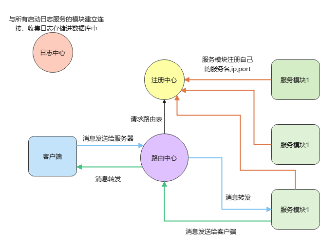
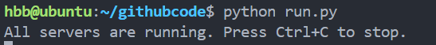
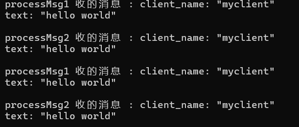
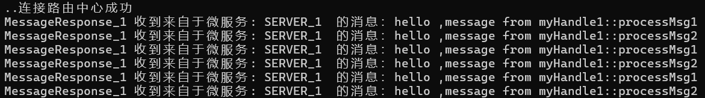

# HBB框架使用说明

## 项目功能说明

​	本项目旨在设计和实现一个高性能、低耦合的微服务集群框架，满足应用的分布式部署需求，框架由路由中心、注册中心和日志中心组成。路由中心负责客户端与服务功能模块之间的消息转发，所有的客户端均与路由中心连接，根据客户端提供所需的服务模块名转发给对应功能模块，日志中心收集框架日志并存储至数据库，用户可自由选择是否使用日志中心，如果不使用默认控制台打印，注册中心管理服务功能模块信息并向路由中心提供路由转发数据。框架支持动态扩展服务模块，无需重启即可实现横向扩展，同时可快速剔除异常或失效模块，确保系统高可用性。



- **高并发网络通信：**

  ​	基于libevent搭建多Reactor模型，结合**epoll的ET模式和非阻塞I/O**，实现高效的事件驱动网络通信架构,路由中心、注册中心、日志中心均基于多Reactor模型，并且提供给服务功能模块多Reactor模型接口。

- **全双工通信：**

  ​	基于**双向代理模式**设计，确保客户端与微服务功能模块之间的消息能够实时地双向传输。

- **自定义通信消息格式：**

  ​	 使用protobuf定义**统一的消息格式**，包括消息头大小（int）、消息头和消息体。消息头中存储消息体大小及所需微服务信息，解决了TCP黏包、拆包问题，同时路由中心仅需解析消息头即可高效完成消息转发，可支持跨语言通信。

  ​	消息体可以是任何由使用者利用protobuf定义生成的C++类，类中存储着需要传输的信息，传输这个类序列化后的数据，这个类序列化后数据的大小存入消息头中，消息头中还存储着消息id和所需的服务模块名，路由中心根据服务模块名转发消息给对应的功能模块，功能模块根据消息id调用相应的处理函数。

- **日志批量异步发送:**

  ​	将日志信息加入队列后，定时以批量异步方式发送至日志中心，从而降低频繁网络 I/O 操作对性能的影响。

- **数据库连接池:**

  ​	封装MySQL API，采用**生产者-消费者模型**动态管理连接池大小，可根据使用情况自动扩展或缩减连接数量，提升日志中心的性能。

  ​	数据库连接池以单列模式设计，以队列的形式存储与数据库的连接，同时另外启动消费者和生产者线程，

  消费者线程每个200ms检测队列头部连接，如果头部连接的空闲时间超过设置的最大空闲时间并且当前连接的数量大于最小连接数，则销毁改连接，生产者线程一直堵塞在条件变量上，直到队列为空并且连接的总数小于最大连接数时唤醒消费者线程创建新的连接加入队列中。

- **负载均衡:**

  ​	路由中心根据消息头解析出所需的目标服务集群，使用**轮询策略**，在服务实例之间均匀分发请求，避免单点过载。

- **动态路由:**

  ​	服务功能模块通过提供的专用接口向注册中心动态注册服务信息。通过**心跳包机制**实时检测服务模块的运行状态，当检测到掉线时触发接口的**自动重连机制**，定时尝试重新连接。路由中心定期从注册中心获取最新的服务路由信息，确保客户端请求始终转发到健康的服务实例。

- **一些细节说明**：

  - 首先任何一个服务功能模块上线时必须向注册中心注册，我提供了专门的接口注册，需要向注册中心注册自己的服务名称，ip地址以及端口号，不同的服务功能模块运行实例可以注册一样的服务名称，但是不同的服务功能模块运行实例需要能处理相同的业务(就是业务代码是一样的，ip和port可以不同)，路由中心根据服务功能模块名称轮询转发给这些同服务名称的不同服务功能模块运行实例，以此进行负载均衡。
  - 我提供了专门的接口给服务功能模块向注册中心注册微服务信息，这个接口其实就是单例类，路由中心会通过心跳机制去检测这个服务功能模块的网络状态，判断它是否下线，并且提供自动重连机制让它重新上线，路由中心定期去向注册中心请求更新路由表（也就是有哪些模块注册啦），每当有服务功能模块上线或者下线时，注册中心主动发送请求让路由中心去跟新路由表。
  - 首先客户端与路由中心建立连接，这个时候路由中心并不会马上去与服务模块建立连接（这样做的原因是数据都没发送去与服务功能模块建立连接浪费资源），当客户端需要发送第一条数据时，路由中心会解析用户发送消息头里面的所需服务功能模块名称，然后查询路由表根据轮训选择出一个对应的服务功能模块运行实例，然后路由中心请求和这个实例连接，我设置了三种连接状态分别是**连接成功、连接失败、正在连接**，路由中心请求和这个实例连接后，马上判断连接状态，如果是连接成功，直接转发消息。如果是连接失败，路由中心关闭与客户端的连接。如果是正在连接中，把客户端的发送的消息发送存储到路由中心和功能实例连接所属类的消息队列里面（路由中心总不可能在这里一直等待它和功能实例的连接结果），当路由中心和功能实例连接成功后，再把消息队列中的消息发送至功能实例，并且路由中心会保持与这个功能实例的TCP长连接。后续客户端发送数据至路由中心，路由中心直接转发。

## 未来将会加入的功能

- **加密通信：**框架中我预留openssl的TLS/SSL传输层安全协议的接口，但是还有一些小的问题没有解决。
- **日志中心重构：**在日志中心收到框架的日志消息后，会将日志消息暂存起来，然后定时批量的写入mysql中，日志中心中心一定是高并发的，它会同时收到框架基础组件和业务模块的消息，我希望提升它的性能并且如果日志中心由于某些原因突然下线，那么存在内存中的消息将会丢失。为了解决这些问题，我会引入redis和专用的消息队列工具RabbitMQ，收到消息后将消息写入redis中，redis定期将积累的数据推送到消息队列，随后利用消息队列定期消费数据，批量插入到mysql中。

## 安装

### 环境说明

本项目基于***Ubuntu 18.04***开发，并且使用了宏机制可以移植部署于window系统。

需要安装***libevent,openssl,protobuf,mysql,python3,cmake,gcc,g++***。

```bash
hbb@ubuntu:~/HBB$ pkg-config --modversion libevent
2.2.0-alpha-dev
hbb@ubuntu:~/HBB$ openssl version
OpenSSL 1.1.1  11 Sep 2018
hbb@ubuntu:~/HBB$ protoc --version
libprotoc 3.8.0
hbb@ubuntu:~/HBB$ mysql --version
mysql  Ver 14.14 Distrib 5.7.42, for Linux (x86_64) using  EditLine wrapper
hbb@ubuntu:~/HBB$ python3 --version
Python 3.6.9
hbb@ubuntu:~/HBB$ cmake --version
cmake version 3.10.2
hbb@ubuntu:~/HBB$ gcc --version
gcc (Ubuntu 9.4.0-1ubuntu1~18.04) 9.4.0
hbb@ubuntu:~/HBB$ g++ --version
g++ (Ubuntu 9.4.0-1ubuntu1~18.04) 9.4.0
```

编译安装基础库以及**路由中心，注册中心，日志中心**可执行文件

```bash
mkdir build
cd build
cmake ..
make
```

安装成功后，bin目录下出现三个可执行文件***gateway_server ，log_server ，register_server***,lib目录下出现两个静态库


启动**路由中心，注册中心，日志中心**。

```bash
cd ../
python run.py
```

启动成功后显示



## 通信示例

编译

```bash
cd exampleCode/
mkdir build
cd build
cmake ..
make
cd ..
```

此时exampleCode/bin目录下出现两个可执行文件***my_client ，my_service***

```bash
hbb@ubuntu:~/githubcode/exampleCode$ ls bin
my_client  my_service
```

运行服务端

```bash
./bin/my_service
```




运行客户端

```bash
./bin/my_client 
```



## 示例代码说明

#### 利用protobuf定义双方将要传送的消息

框架基于protobuf通信，首先需要定义消息类型，客户端和服务器均根据消息类型调用对应的处理回调函数，消息类型存储与消息头中，然后定义消息体，消息体是任意根据protobuf定义生成的c++类。

***`mymsg.proto`***

```protobuf
syntax="proto3";
// 自己定义消息类型，微服务实例应用消息类型提供对应处理
// 自定义枚举值从128开始,1-127供框架内部使用（用户不可使用）
enum myMsgType{
	MSG_NO_USE = 0;  // proto3 必须以 0 开始，作为默认值
	MSG_REQ1=128;
	MSG_RES1=129;
	MSG_REQ2=130;
	MSG_RES2=131;
	MSG_REQ3=132;
	MSG_RES3=133;
};

// 请求消息类型,自己定义
// 客户端发送给服务器
message myReqMsg{
	string client_name=1;
	bytes text=2;
};

// 请求恢复消息类型,自己定义
// 服务器发送给客户端
message myResMsg{
	string service_name=1;
	bytes text=2;
};
```

生成***mymsg.pb.cc,mymsg.pb.h***文件，将这两个文件分别置于客户端和服务端的文件夹下面。

#### 客户端部分

​	需要继承类HBBServiceClient，HBBServiceClient使用观察者模式设计模式，子类调用RegCB函数完成消息回调注册，客户端与路由中心建立连接，并且要调用set_service_name()函数设置所需的微服务名，路由中心根据微服务名转发给对应微服务功能模块。

***`my_client.cpp`***

```c++
#include <iostream>

#include "HBBlog_client.h" // 导入日志接口
#include "HBBconfig.h" // 一些配置的宏，例如路由中心的端口，
#include "HBBservice_client.h" // 我提供给客户端的接口
#include "mymsg.pb.h" // 自己定义的消息信息


// 微服务名词，用于进行路由转发
#define SERVER1 "SERVER_1" // 服务模块的名称

using namespace std;
//using namespace HBB;
class MyClient :public HBBServiceClient {
public:
	// 单例模式构造对象
	static MyClient* Get() {
		static MyClient client;
		return &client;
	}
	// 删除复制构造函数
	MyClient(const MyClient&) = delete;
	MyClient(MyClient&& ) = delete;
	// 连接建立的回调函数
	virtual void ConnectedCB() override {
		
	}

	// 设置消息回调函数
	static void RegMsgCallback() {
		// 注册消息回调函数
		RegCB((HBBmsg::MsgType)myMsgType::MSG_RES1,(MsgCBFunc)&MyClient::MessageResponse1);
		RegCB((HBBmsg::MsgType)myMsgType::MSG_RES2, (MsgCBFunc)&MyClient::MessageResponse2);
	}
private:
	MyClient() = default;
	
	// 收到消息 myMsgType::MSG_RES1 的回调函数 
	void MessageResponse1(HBBmsg::HBBMsgHead* head, Msg* msg) {
		// 解析消息体
		myResMsg resMsg;
		if (!resMsg.ParseFromArray(msg->data,msg->size)) {
			LOGERROR("myResMsg::ParseFromArray failed!");// 提供的日志接口
			return;
		}
		string res_service_name=resMsg.service_name();
		string res_text=resMsg.text();
		cout <<"MessageResponse_1 收到来自于微服务: " << res_service_name << "  的消息：" << res_text<<endl;
		
	}

	// 收到消息 myMsgType::MSG_RES2 的回调函数 
	void MessageResponse2(HBBmsg::HBBMsgHead* head, Msg* msg) {
		// 解析消息体
		myResMsg resMsg;
		if (!resMsg.ParseFromArray(msg->data, msg->size)) {
			LOGERROR("myResMsg::ParseFromArray failed!");// 提供的日志接口
			return;
		}
		string res_service_name = resMsg.service_name();
		string res_text = resMsg.text();
		cout << "MessageResponse_2 收到来自于微服务: " << res_service_name << "  的消息：" << res_text<<endl;
	}
};

int main()
{
	cout << "************** MyClient ****************" << endl;
	#define CON MyClient::Get()
	MyClient::RegMsgCallback(); // 注册消息回调
	InitLog("127.0.0.1", LOG_PORT, -1, "my_client"); // 连接日志中心，不启动的话本地控制台打印
	CON->set_server_ip("127.0.0.1"); // 路由中心在本地
	CON->set_server_port(API_GATEWAY_PORT); // 路由中心的端口
	CON->set_auto_connect(true); // 设置自动重连
	CON->StartConnect(); // 开始连接
	this_thread::sleep_for(3s); 
	while (!CON->is_connected()) { // 等待连接成功
		cout << "等待连接" << endl;
		this_thread::sleep_for(10ms); 
	}
	cout << "连接路由中心成功" << endl;
	{
		// 发送消息给 SERVER1  模块
		while (1)
		{
			CON->set_service_name(SERVER1); // 消息转发给 SERVER1 模块
			myReqMsg reqMsg; // 自己定义的请求消息
			reqMsg.set_client_name("myclient");
			reqMsg.set_text("hello world");
			CON->SendMsg((HBBmsg::MsgType)myMsgType::MSG_REQ1, &reqMsg); //发送消息类型为 MSG_REQ1 的消息给 SERVER1
			CON->SendMsg((HBBmsg::MsgType)myMsgType::MSG_REQ2, &reqMsg); //发送消息类型为 MSG_REQ2 的消息给 SERVER1
			this_thread::sleep_for(1s);
		}

	}
	// 等待消息回复
	while (1);
	return 0;
}
```

#### 服务端部分

服务端在启动监听端口前，需要向注册中心注册直接的微服务信息。

服务端部分采用工厂设计模式和客户端通信，需要继承HBBService，实现它的虚函数CreateServiceHandle，

每当有新的连接建立的时候CreateServiceHandle会返回一个继承抽象类HBBServiceHandle的子类，子类中处理与客户端通信。

***`my_service.cpp`***

```c++
#include <iostream>

#include "HBBconfig.h" // 一些配置的宏，例如路由中心的端口，

#include "HBBservice.h" // 提给给服务端的接口
#include "HBBlog_client.h" // 导入日志中心

#include "mymsg.pb.h" // 自己定义的消息信息


// 微服务名词，用于进行路由转发
#define SERVER1 "SERVER_1" // 第一种服务模块的名称
using namespace std;
class myHandle1 :public HBBServiceHandle
{
	// 一个HBBLogHanlde1 负责与一个 client 通信
public:
	myHandle1()
	{
		RegMsgCallback();
	}
	// 处理消息 MSG_REQ1 的回调函数
	void processMsg1(HBBmsg::HBBMsgHead* head, Msg* msg) {
		myReqMsg req;
		if (!req.ParseFromArray(msg->data,msg->size)) {
			LOGERROR("myReqMsg::ParseFromArray failed!");// 提供的日志接口
		}
		// 打印日志接口的信息
		cout <<"processMsg1 收的消息 : "<< req.DebugString() << endl;
		// 返回消息
		myResMsg res;
		res.set_service_name(SERVER1);
		res.set_text("hello ,message from myHandle1::processMsg1");
		// 发送消息回去
		SendMsg((HBBmsg::MsgType)(myMsgType::MSG_RES1),&res);
	}
	void processMsg2(HBBmsg::HBBMsgHead* head, Msg* msg) {
		myReqMsg req;
		if (!req.ParseFromArray(msg->data, msg->size)) {
			LOGERROR("myReqMsg::ParseFromArray failed!");// 提供的日志接口
		}
		// 打印日志接口的信息
		cout << "processMsg2 收的消息 : " << req.DebugString() << endl;
		// 返回消息
		myResMsg res;
		res.set_service_name(SERVER1);
		res.set_text("hello ,message from myHandle1::processMsg2");
		// 发送消息回去
		SendMsg((HBBmsg::MsgType)(myMsgType::MSG_RES1), &res);
	}
	static void RegMsgCallback() {
		RegCB(
			(HBBmsg::MsgType)myMsgType::MSG_REQ1
			, (MsgCBFunc)&myHandle1::processMsg1
		);
		RegCB(
			(HBBmsg::MsgType)myMsgType::MSG_REQ2
			, (MsgCBFunc)&myHandle1::processMsg2
		);
	}

};
class MyServer1 :public HBBService
{
public:
	// 采用工厂模式，每次有新的连接建立，返回一个 HBBLogHandle1 对象与新的连接通信
	HBBServiceHandle *CreateServiceHandle() override
	{
		return new myHandle1();
	}
};
int main()
{
	std::cout << "HBBLOG SERVER" << std::endl;
	// 初始化日志服务
	int server_port = 18888; // 这个服务在 1888号端口上运行
	InitLog("127.0.0.1", LOG_PORT, server_port, SERVER1); // 连接日志中心，不启动的话本地控制台打印
	// 向注册中心注册
	myHandle1::RegMsgCallback(); //  注册消息回调
	MyServer1 server;
	server.set_arg(server_port,SERVER1,"127.0.0.1",REGISTER_PORT); // 向注册中心注册,第三个参数为注册中心地址，假设在本地
	server.Start(); // 开始监听
	while (1);
	return 0;
}

```

